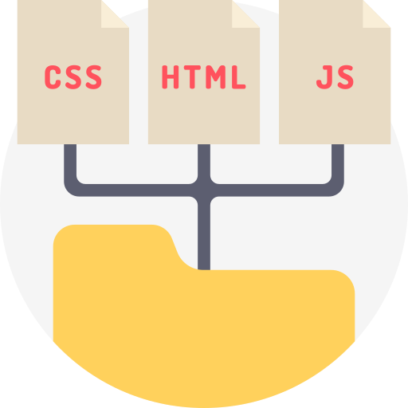

## 
Desenvolvimento Front-End

 
  
  
  

 

Alguns projetos realizados:
 
 <a href="https://sarahprando.github.io/exercicios-origamid/portfolio/portfolio.html">Portfólio</a> 
 - <a href="https://sarahprando.github.io/exercicios-origamid/bikcraft/home.html">Bikecraft</a>
  

 

 
  

